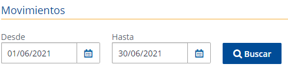
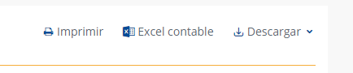

# Budget-Valley
> python `3.8.2` 

## Create Enviroment
Create a new enviroment you have to use, `python3 -m venv venv`, to active the enviroment just have to type `source venv/bin/activate`.

### Dependency and Package Managment Setup
Install all Packages that we need for the project, then when all be installed, 
we need to a list package installed in a txt file, for do that, we need to type `pip3 freeze > requirmentes.txt`, to push the list dependecies into the file.
This file help us keep any version of each Package was installed.

To install packages `pip3 install -r requirements.txt`

## Execute function
Drop your Excel Contable from *Banco General* to CSV file. (You can filter first before you export)

`python3 app.py`

## Screenshots

### Filter
---

### Export Button
---

